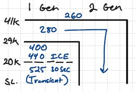

# General
## General
- Written based on RKA's 
- Oral : Memory Items, Limits, W&B, Performance & Systems
- AFM & POM
    - AFM TO -> Max Continous
    - POM Decent -> Ldg
- SUP 269 : increases weight to 16,300 lbs
- Size "50 x 50 x 50"
- Tail floodlights must be off in clouds
-nose: holdes accesories, O2 bottles, lights, radomes. 

## Door
- Main door:
    - Red = Bad = Unlocked
    - white = good = Locked
    - Locked when all 8 pins = white
- Escape Hatch
    - Plyg type
    - Loced via pin & Bracket
- Cargo Door
    - 450 lbs (max cargo weight?)
    - acress to fire bottles/battery/hydrolic resaveur

# Electrical
- Battery
    - Acessed via baggage compartment
    - 24V 40ah
    -orginaly NiCad / now leadAcid
        - NiCad's had a history of thermal runaways and were more MX heavy. If still equiped have a temp limit of -15&deg;.
    - 22V minamum start
    - Emergency Power Sourse via the Emergency Buss
- Starter Generator 
    - Note the transient limits have to do with the G-Stab anti Ice system
    - 

